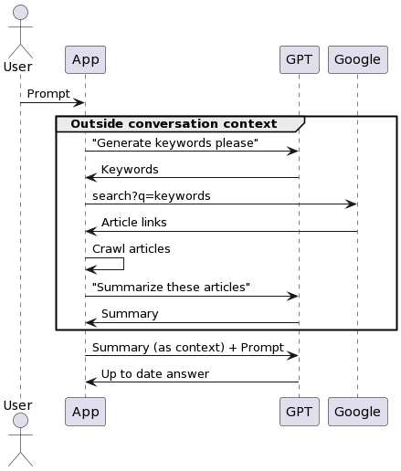

# realtime-chatgpt

### ChatGPT is very cool
But it can't crawl the web. It can't get the latest information on the net.

### Idea
So I got an idea, what if I add a simple proxy program that accepts user input and crawls data from google to get 
the articles to feed it into the conversation with ChatGPT? ChatGPT can generate the google query keywords based on 
user's prompt (which will be fed into the crawler) and summarize the crawled articles.



### Challenges
The idea seemed simple enough, but I failed to notice several things:
* `ChatGPT API` is **not ready** yet, there's only the `Completion API`
* No more free credits :(
* Too much google query will get rate limited
* I tend to underestimate man-hour when I'm excited
* I get bored easily

### Result
So, here we go, a (kinda) working implementation of the idea I had. Due to the implementation using completion API, the
app is actually very customizable (eg: can put starting context of the AI as quirky or sarcastic or naughty, etc). Some
 logics (eg: Summarization logic) are kinda wonky, but it can work. Note that to invoke the crawl logic need to put in 
`!real` keyword before your prompt, eg: `!real predict fed interest rate for Q4 2023`.

### How to
1. Make sure you have python3 installed in your system
2. Install all the dependencies in requirements.txt
3. Buy or borrow openai API Key
4. Run `OPENAI_API_KEY={your API key} python3 main.py`
5. It will open a console that you can use to chat with the bot
```
You: hi, whats your name?
Bot: My name is OpenAI. It's nice to meet you!
You: nice to meet you, can you tell me a short story?
Bot: Sure! Once upon a time, there was a brave knight who set out on a quest to save a princess from a dragon. He rode his horse through dark forests and treacherous mountains, eventually arriving at the dragon's castle. He fought the dragon and emerged victorious, rescuing the princess and returning her safely to her kingdom. The kingdom rejoiced and the knight was hailed a hero.
You: do you know what's the knight's name?
Bot: The knight's name was never revealed, but he was known throughout the kingdom as the brave and noble knight who saved the princess.
You: 
```

### Fun fact
* I can say about 50% of the code here are generated using ChatGPT. The rest 50% are either I wrote manually (cause
asking ChatGPT is slower) or ChatGPT wrote them but then they're refactored by me (ChatGPT is not bug-free, just like us
devs). It was fun trying to develop using (alongside) ChatGPT.
* I think `realtime` is not a suitable name, but its kinda catchy, so I'm keeping it.
* I believe some similar products (even paid ones) has the same basic idea as this. I don't believe that I'm the only 
person to think of this idea.
* This readme is fully written by me, not ChatGPT.

### Future improvements
* I made a ContextManager (actually ChatGPT made it) so that this app can run as a server serving many clients. Each
client can open multiple conversations (contexts).
* All the prompts should be customizable (and maybe made into profiles that user can choose). By prompts, I meant: 
starting context prompt, context summarization prompt, keyword generation prompt, article summarization prompt, etc
* Maybe use the ChatGPT API project (the one that reverse engineer from the web UI)
* Add more commands, not just `!real` that do other tasks
